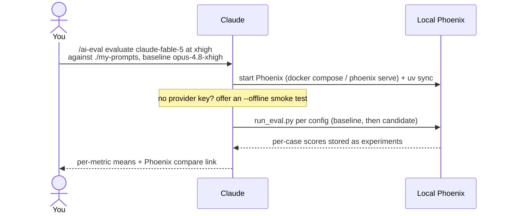
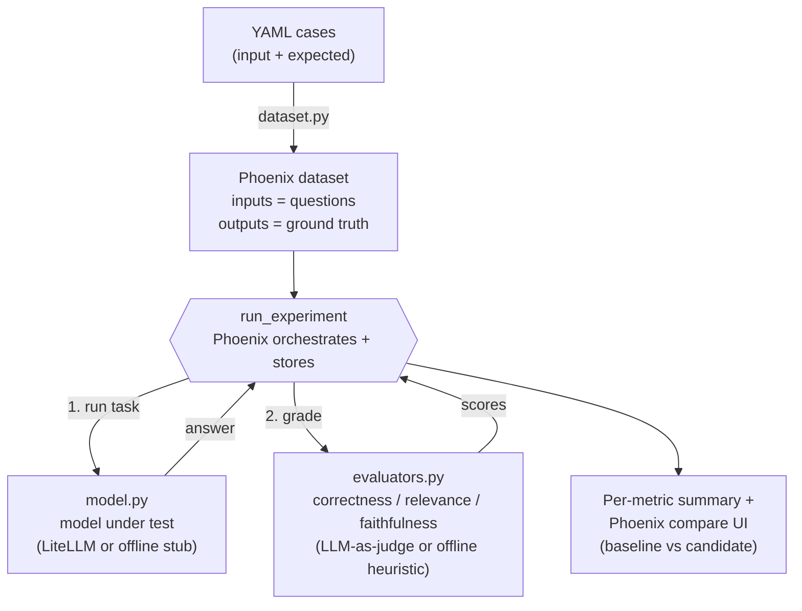

# ai-eval

Run repeatable LLM evaluations in a locally-hosted Arize Phoenix against your own
prompts and known-good ("ground truth") answers. Each run is a Phoenix
experiment tagged with its model/effort/param configuration, so you can compare
a candidate against a baseline on the metrics that matter: **correctness**,
**relevance**, **faithfulness**.

This file covers how to use it from Claude Code, how it works, the architecture,
and its limits. For the raw commands, see [`SKILL.md`](SKILL.md).

## Using it from Claude Code

First install the skill where Claude Code discovers skills - symlink or copy the
`ai-eval` directory into `~/.claude/skills/` or `<project>/.claude/skills/` (see
the [repo README](../../README.md)). Then, in a Claude Code session, run it by
typing:

```
/ai-eval
```

That invokes the skill: Claude reads `SKILL.md` and drives the whole run for you.
You supply three things (Claude asks for whatever is missing) - the **dataset**
(prompts + ground truth), the **config under test** (model, effort, any params),
and a **baseline** to compare against.

A typical session:



1. **You** type `/ai-eval` with (optionally) what to test and where your prompts
   live.
2. **Claude** starts local Phoenix, prepares the env, and checks for a provider
   key - offering an `--offline` pipeline smoke test if none is set.
3. **Claude** reads your one-YAML-file-per-case dataset (or helps you author
   cases from prompts you paste), then runs the experiment for each config.
4. **Claude** reports the per-metric means (correctness / relevance /
   faithfulness) and links the Phoenix compare view, where you read each case's
   output and the judge's explanation.

To add a comparison later, run `/ai-eval` again with a new config on the same
dataset - Phoenix keeps every run as a comparable experiment.

## Flow



Phoenix is the harness only - it never calls an LLM. The skill supplies the
dataset, the task (thing under test), and the graders.

## Components

- **`compose.yaml`** - local Phoenix (`arizephoenix/phoenix:latest`), UI +
  collector on `:6006`, gRPC on `:4317`, data persisted to a named volume.
- **`scripts/config.py`** - `RunConfig`, CLI parsing, and the portable
  `effort -> reasoning_effort` mapping.
- **`scripts/dataset.py`** - loads one-YAML-file-per-case directories and
  get-or-creates the Phoenix dataset.
- **`scripts/model.py`** - the task: calls the model under test via LiteLLM, or
  returns a deterministic stub in `--offline` mode.
- **`scripts/evaluators.py`** - three `create_evaluator(kind="LLM")` judges
  backed by a `phoenix.evals.LLM` (real) or token-overlap heuristics (offline).
- **`scripts/run_eval.py`** - the entrypoint that wires it together and prints
  the summary.

## Design decisions

- **LiteLLM** for the model under test and the judge, so the same prompts run
  against any provider. `effort` (a Claude Code concept) maps to LiteLLM's
  `reasoning_effort`; `xhigh` uses an explicit Anthropic thinking budget.
- **One YAML file per case** - readable for long multi-line prompts/answers and
  easy to diff; the directory name becomes the dataset name.
- **Faithfulness, not Hallucination** - Phoenix deprecated `HallucinationEvaluator`
  in favour of `FaithfulnessEvaluator` (faithful/unfaithful, maximised).
- **Offline stub mode** - the model and judge are the only things that need a
  key, so stubbing them lets the full Phoenix pipeline run (and be tested) with
  no key and no spend.

## Limits

- **Offline scores are not meaningful.** They exist to prove plumbing and keep
  tests hermetic. Real evaluation needs a provider key and no `--offline`.
- **Cross-provider effort is approximate.** `effort` maps differently per
  provider; compare within a provider for the cleanest signal.
- **LLM-as-judge is noisy.** Treat a metric drop as a lead to inspect in the
  Phoenix UI (read the output and the judge's explanation), not a verdict. Pin
  the `--judge-model` when comparing runs so the grader is held constant.
- **Datasets are get-or-created by name.** Editing cases after a dataset exists
  needs a new `--dataset-name` (or delete the dataset in Phoenix) to take effect.

## Testing

```bash
bash tests/run.sh     # pytest unit tests: loader, effort map, offline heuristics, config
bash tests/e2e.sh     # brings up Phoenix, runs the 3 examples offline, asserts 3x3 metrics
```

The unit suite needs neither Docker nor an API key. The e2e test needs Docker
but no key.
